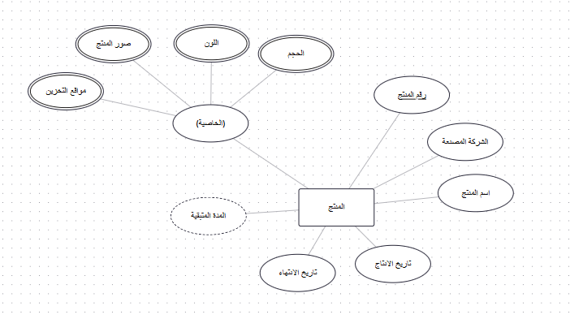
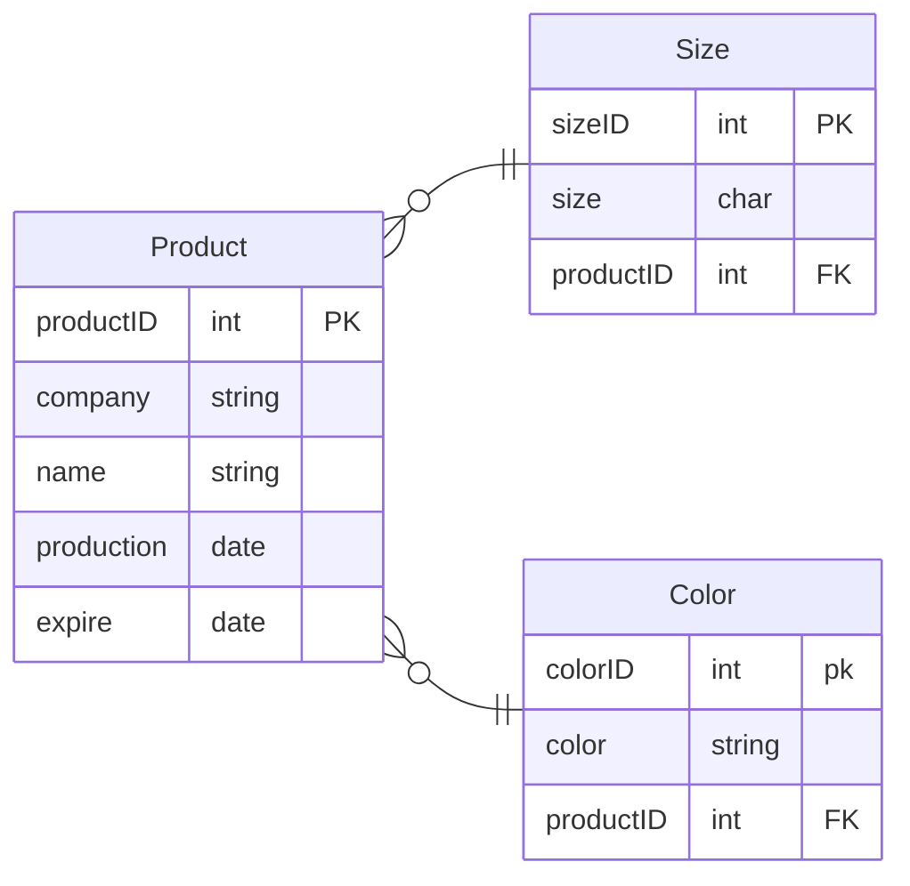

# Solution

**Q:** Convert This ERD to Relational Schema

**Solution:**

```mermaid
erDiagram
  direction LR
  Product {
    productID int PK
    company string
    name string
    production date
    expire date
  }

  Size {
    sizeID int PK
    size char
    productID int FK
  }

  Color {
    colorID int pk
    color string
    productID int FK
  }

  Product }o--|| Size : ""
  Product }o--|| Color : ""

```
