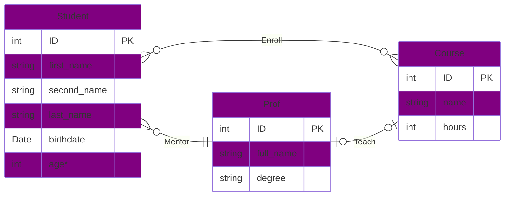

# University Assignment

**Q**: Draw ERD for a university that satisfy this requirements

- In a university, a Student enrolls in Courses. A student can enroll in more than one course, Each course can have more than one student.

- Each student has only one mentor (prof), Professor can mentor more than one student.

- Each Professor can teach only one course.

- Each Course can have only one professor.

- Course can have un-assigned professor.

- Professor can teach no courses.

**Solution**:

