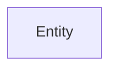
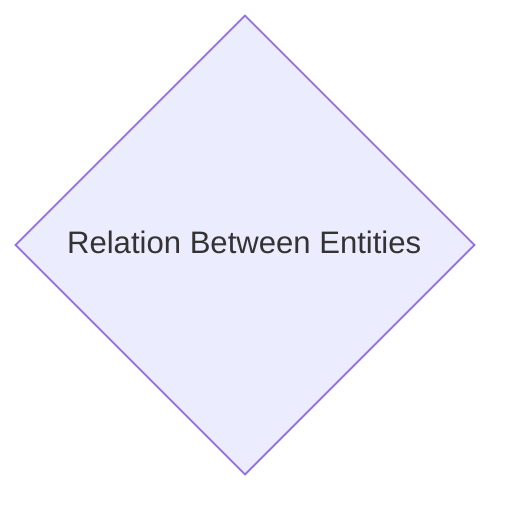
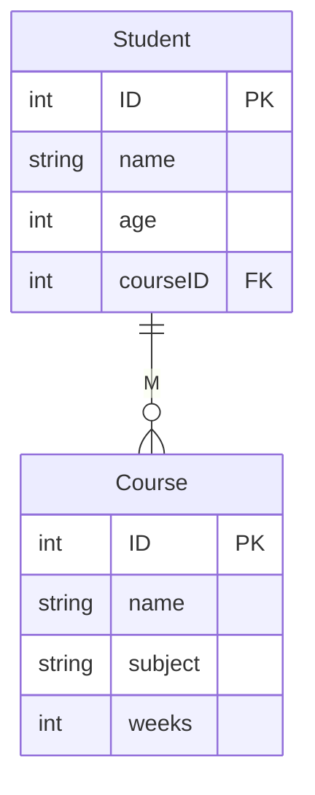
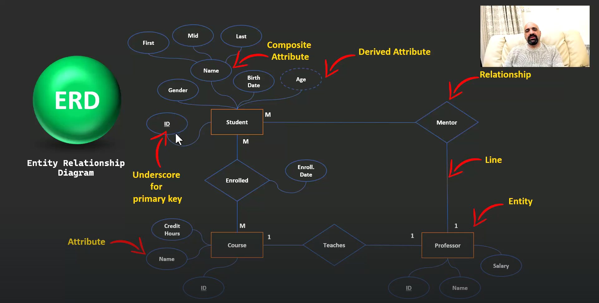
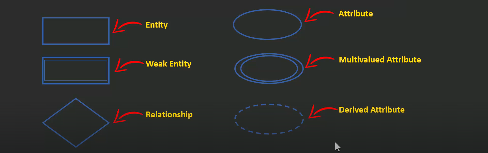

# ERD Symbols

> ERD stands for Entity Relationship Diagram

ER Diagram in RDBMS is widely used to describe the conceptual design of databases.

---

## Rectangles

the are an entity, To identify an entity ask your self if this 'thing' needs to store data about it

---

## Diamond

Represent the relation between two entities and it describe what is the relation between two entities

---

## Line

it is the connection of two entities , _i.e._

As the example above show that One student can have many courses

---

## Composite Attribute

The are the attributes that have inside them their own attribute

---

## Derived Attribute

Any attribute that we can calculate or find from another one, we don't have to allocate a memory for it

---

## Conclusion

---

## Weak Symbols

Double Rectangle: means that the entity doesn't have a primary key

---

## Multi-valued Attribute

if the filed have more than one info or represent two or more things

---

Go Back to the [README](../README.md) to read about the next section which is [**Relationships**](./relationships.md) !
