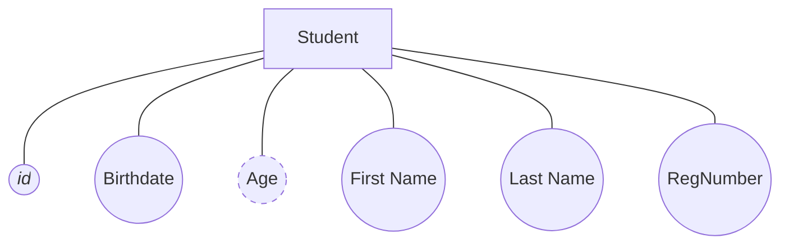
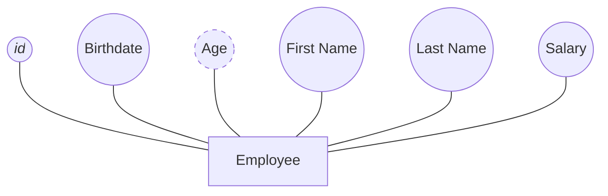
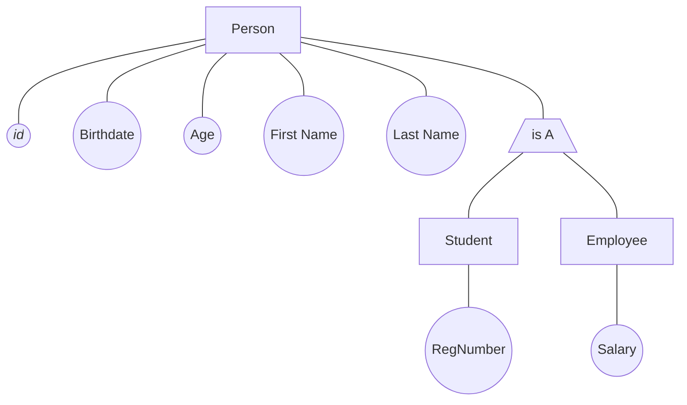

# Generalization

If we have two or more entities with many same attributes we can group them up into a new entity and use a special symbol to say the the two old entities have this same attributes

Ex:

Notice that **id**, **First name**, **Last name**, **Birthdate**, And **Age** are in both **Student** and **Employee**

we can generalize this as the following

it is a bottom-top approach

> Tip: it's like inheritance in OOP

# Specialization

we take deep more attributes from an entity

> We can look at the triangle as the filter in which we remove attributes or add
