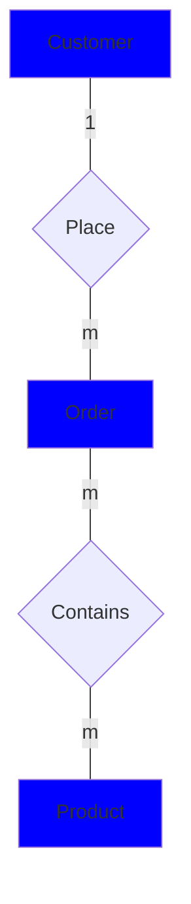

# Many to many relationship

single entity can have many other entities and the other entities can relate to more than single entity

now the Student can enroll many courses, and the course can be shown to many students, so to describe the nature of the relationship

**Example**: draw an ERD for the following entities

- Customer
- Order
- Products

Relationships requirements:

1. One customer can order many orders
2. many orders can contains many products
3. there are a lot of products can be taken to a lot of orders

**Solution**:

one customer can order many orders and many orders can contains many products at the same time many products can be inside may other orders
