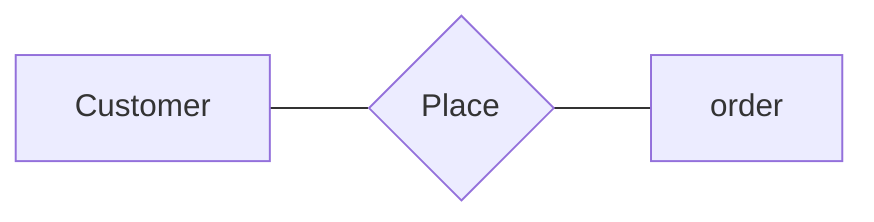
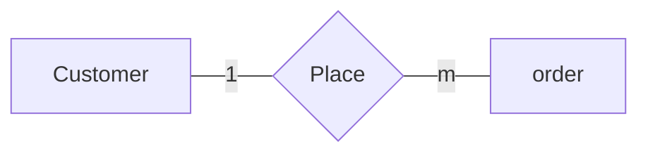
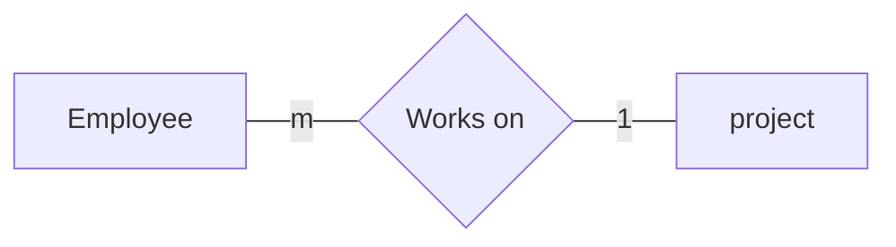
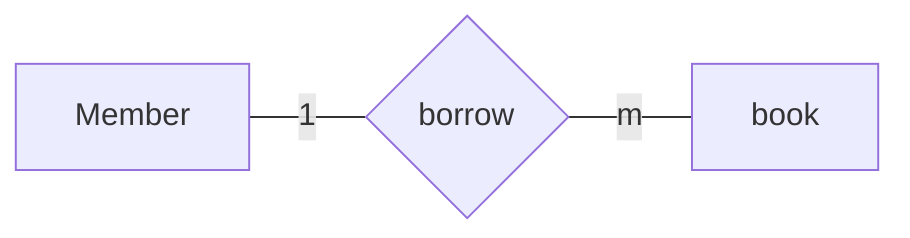
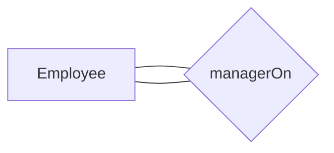
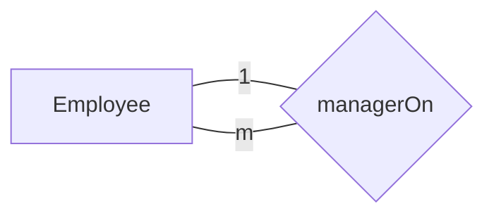

# One to many relationship

Means an entity can have more than one of the other entity, _i.e._ a person can have more than one car

---

it represents with the letter 'm'

the **Customer** can place more than one order so we can represent the relationship like this

the customer can place more than one order (many orders), bu the order can't be to many customers

Example: Draw an ERD with employee (entity 1) and project(entity 2), with this requirements

1. single employee can work on a single project

2. The project can have more than one employees can work on

**Solution**:

Another Example

## Self Referencing Relationships

[See for the recap](./relationships.md#self-referencing-relationship)

As a table

| ID  | Name    | ManagerID |
| --- | ------- | --------- |
| 1   | Ahmed   | null      |
| 2   | Ali     | 1         |
| 3   | Mohamed | 1         |
| 4   | Mahdi   | 2         |

Now the ERD will look like this after knowing the nature of the relationship

Now see [many-to-one](./many-to-one-relationship.md) relationship
