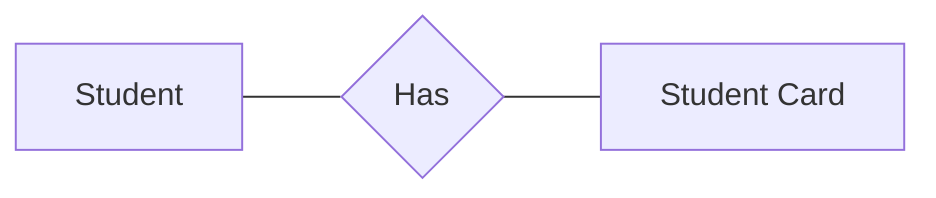
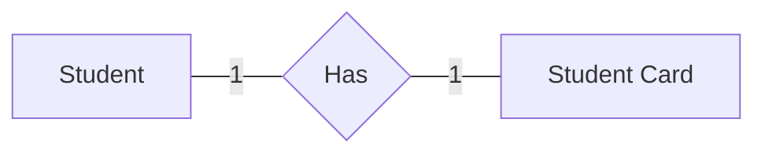
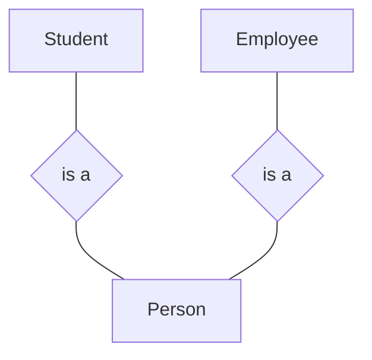
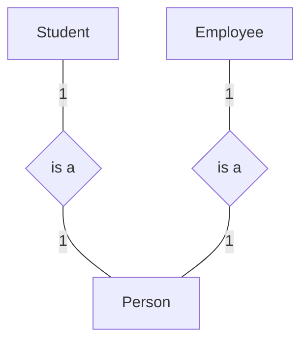

# One to one Relationship

Means every entity has only one of the other-side entity and the other side only have one

In the example above the student only has one university card and the card represents only one student

so the ERD will look like this

---

Another Example

> We have to ask our selfs what is the Nature of the relationship between the **Student** and **Person** from the **Student** perspective, and the **Person** perspective

with describing the relationships it will look like this

---

