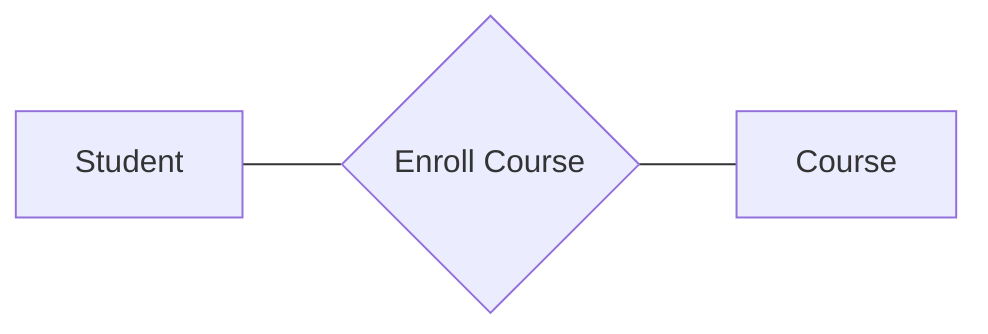
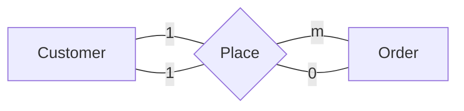
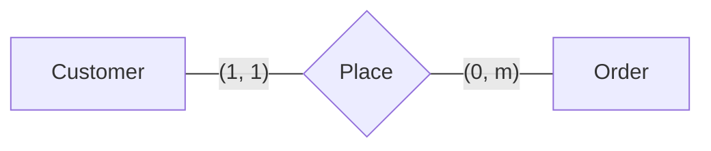
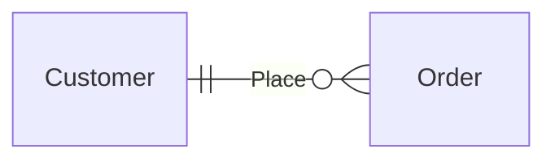
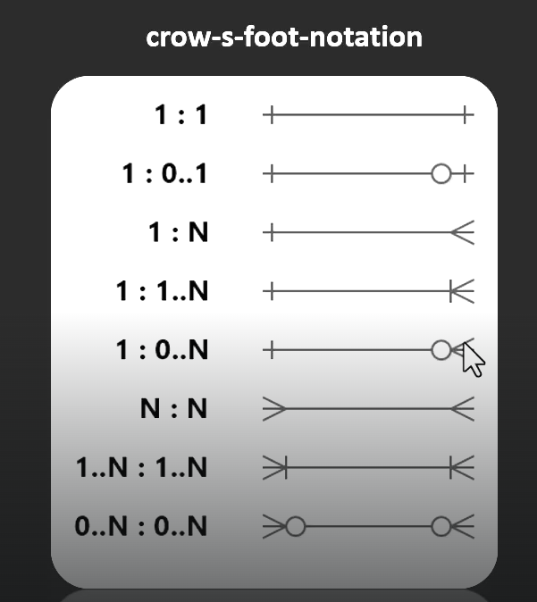

# Relationships

## Normal Relationships

there is a relationship between the student and the course, we can represent it like this

---

> an entity can have one or more relationship

## Self Referencing Relationship

An entity that have relation with other entities with the same type

As a table

| ID  | Name    | ManagerID |
| --- | ------- | --------- |
| 1   | Ahmed   | null      |
| 2   | Ali     | 1         |
| 3   | Mohamed | 1         |
| 4   | Mahdi   | 2         |

now **Ahmed** is the manager of **Ali** and **Ali** is the manager of **Mahdi**

## Relationship Types

### [one-to-one](./one-to-one-relationship.md)

### [one-to-many](./one-to-many-relationship.md)

### [many-to-one](./many-to-one-relationship.md)

### [many-to-many](./many-to-many-relationship.md)

> You have to see the types

## Cardinality Vs. Ordinality

### Cardinality

Refers to the **maximum** number of times an instance of an entity can relate to instances of another

- The **maximum** number of instances from order a customer can have is $m$
- The **maximum** number of instances from customer an order can have is $1$

### Ordinality

Refers to the minimum number of the instance an entity can have from another instance

it tells if the relation is required, optional or mandatory

maybe there is a **Student** with no enrolled **courses**, and maybe there is a course with no **Students** in

> Better Representation is like this
> $$(ordinality, cardinality)$$

## Cardinality Symbols

we can represent the nature of the ordinality and cardinality in a symbols

above example show that a **CUSTOMER** with $(1, 1)$ related to **ORDER** as $(0, m)$

---

converting this ERD to use symbols

it will look like this

- This symbols called _cross-s-fot-notation_

see the image below

Example

---

Example

---

Example

Each employee should have zero on one manager, and each employee can only be a manager for zero or many

---

Example

---

At the end, Here a [guid](./steps-to-erd.md) to crete ERD
