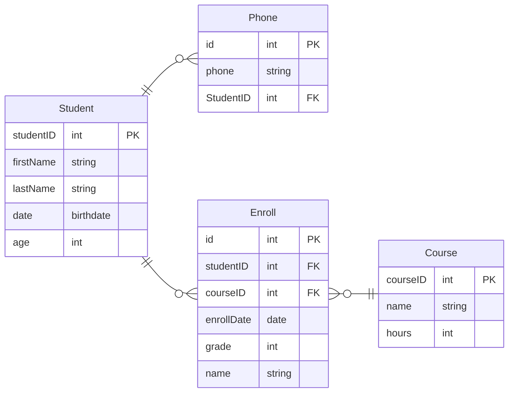
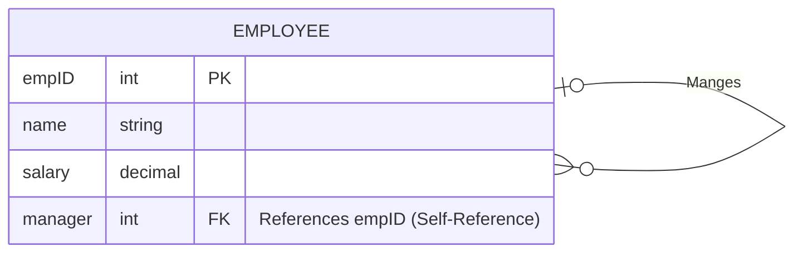
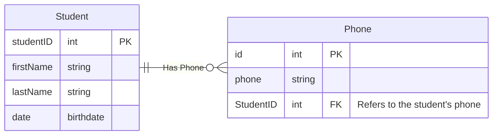
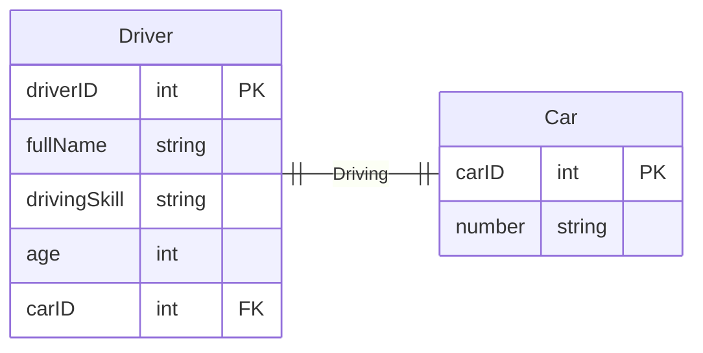
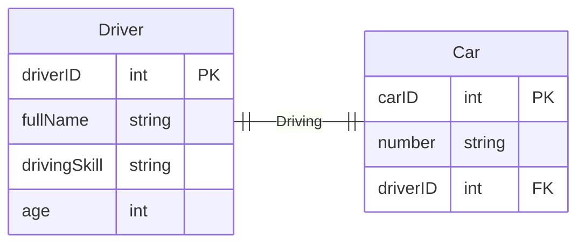
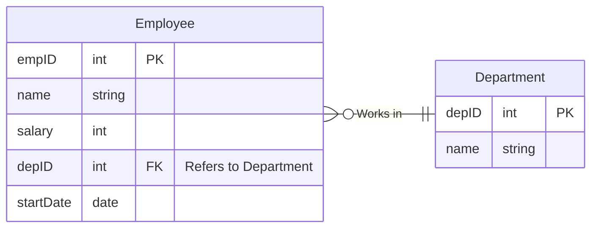
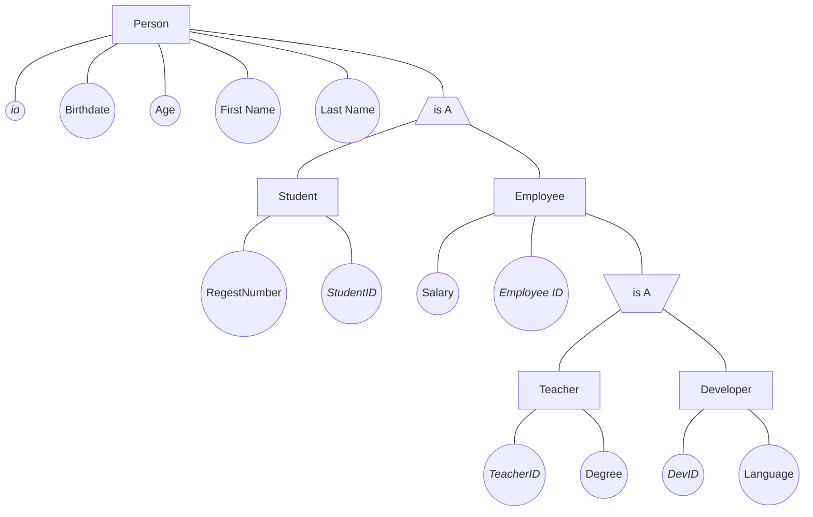
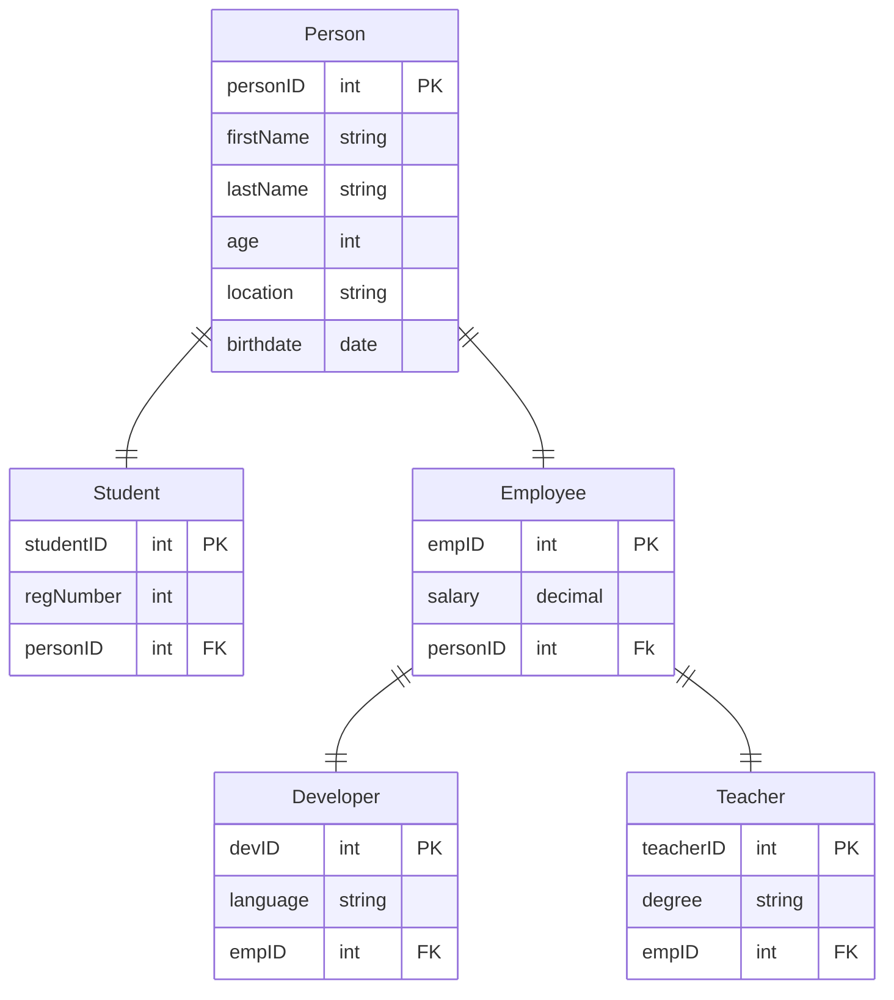
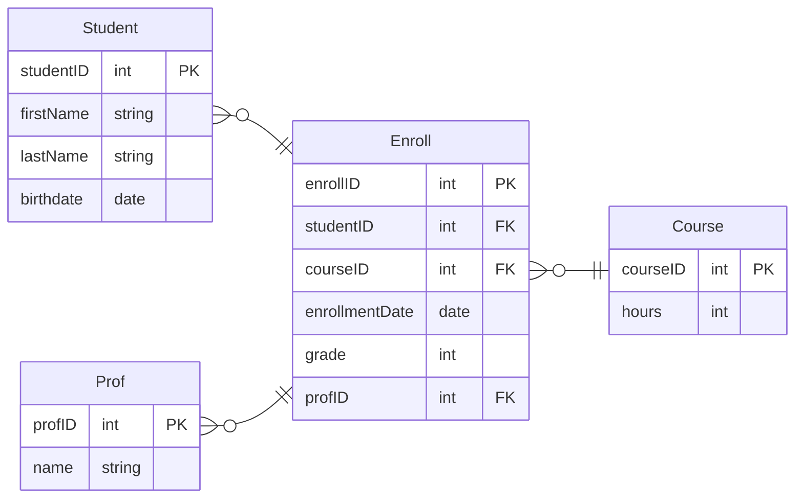

# Relational Schema

It's a part of the logical diagram
It's the second step after creating the [ERD](../erd/ERD%20Symbols.md)

---

For example this ERD

Relational Schema it is a more detailed diagram and tables

After converting this ERD to relational schema it will look like this

## Converting ERD Relations Into Relational Schema

- [Self-Referential](#self-referential-to-relational-schema)

- [Composite, Multivalued And Derived Attributes](#composite-multi-valued-and-derived-attributes)

- [One To One](#one-to-one)

- [One To Many / Many To One](#one-to-many--many-to-one)

- [Many To Many](#many-to-many)

- [Generalization And Specialization](#generalization-and-specialization)

- [Associative Entity](#associative-entity)

### Self Referential To Relational Schema

Example:

> In the same table we add a foreign key refers to the primary key of the same table

---

### Composite, Multi valued And Derived Attributes

Example

> We ignore the composite attribute and only take it's sub-attributes

> Derived attributes ignored also

> Create a new table for the multivalued attributes

Our relational schema will look like this

---

### One To One

Example

There are two solution

- Take the primary key of the **_car_** and put it inside the **_driver_** table as foreign key

- Take the primary key of the **_driver_** and put it inside the **_car_** table as foreign key

**First Solution**:

**Second Solution**:

---

### One To Many / Many To One

Example

> Always look for the **many** side and take the PK and any attributes from the relationship and the **one** side and put them inside the **many** side table

---

### Many To Many

> There is always a third Table connect the two entities

Let's take the same example we hade before

> The third table is **_Enroll_**

> Take the PK from both sides and store them as FK in the third table

In some places they combine PKs of both sides and make it as PK to the third table

**Students Table**

| studentID | first_name | last_name | birthdate  | age |
| --------- | ---------- | --------- | ---------- | --- |
| 1         | John       | Smith     | 2002-05-15 | 22  |
| 2         | Alice      | Johnson   | 2001-08-22 | 23  |

**Courses Table**

| courseID | name             | hours |
| -------- | ---------------- | ----- |
| 1        | Database Systems | 3     |
| 2        | Data Structures  | 4     |

**Enroll Table**

| enrollID | studentID | courseID | enrollmentDate | grade |
| -------- | --------- | -------- | -------------- | ----- |
| 1        | 1         | 2        | 1/1/2025       | 90    |
| 2        | 1         | 1        | 1/1/2025       | 40    |
| 3        | 2         | 1        | 2/6/2020       | 88    |
| 4        | 1         | 1        | 1/5/2025       | null  |

Take a look at the enrollID number 4

| enrollID | studentID | courseID | enrollmentDate | grade |
| -------- | --------- | -------- | -------------- | ----- |
| 3        | 2         | 1        | 2/6/2020       | null  |

> If we combined the PKs of student and course we will have the same Pk for the table which is a huge mistake

---

### Generalization And Specialization

Example

> Remember that the relationship is always Ont-To-One

> Take the PK of the parent and use it as FK in the child

---

### Associative Entity

Example

1. Create a bridge table for the [many to many](#many-to-many) relationship

2. Take PKs for each table and put them in the bridge table, Also take the PK from the associative relation and put it in the bridge table

It will look like this

> Associative Entities are always with the [many to many](../erd/many-to-many-relationship.md) relationship

---
