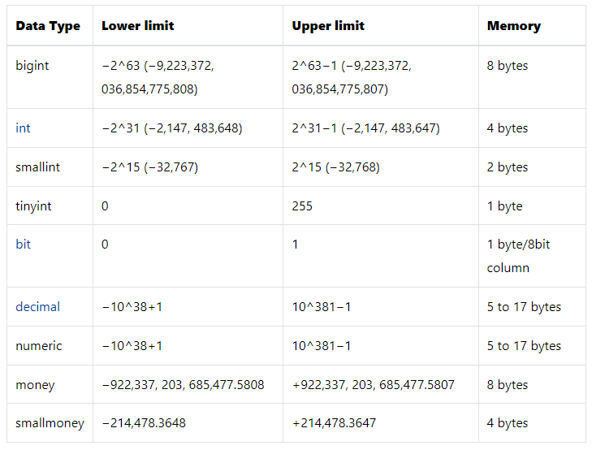
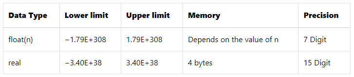
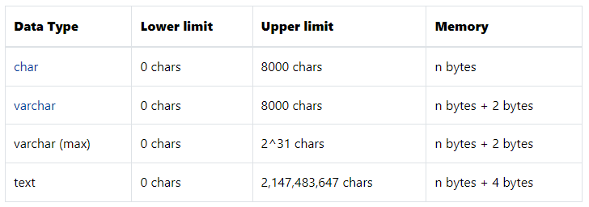
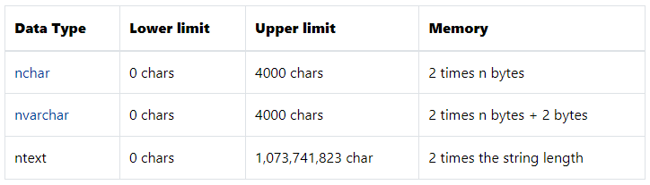
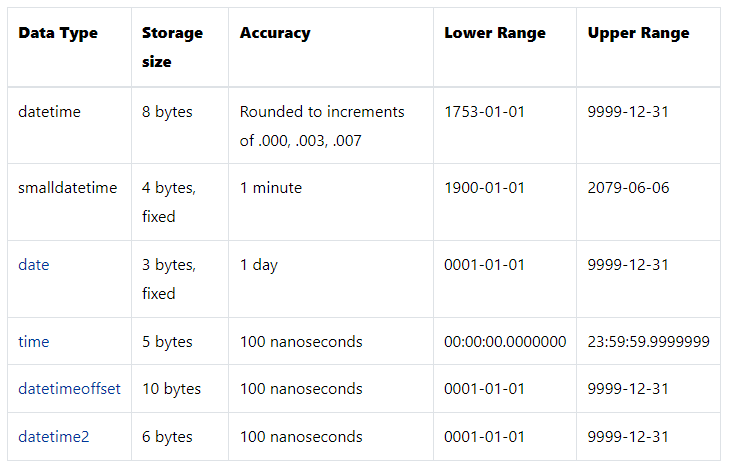
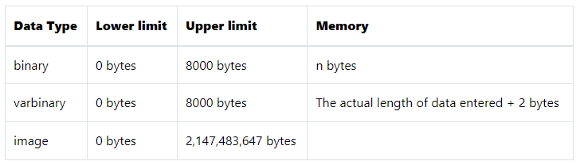
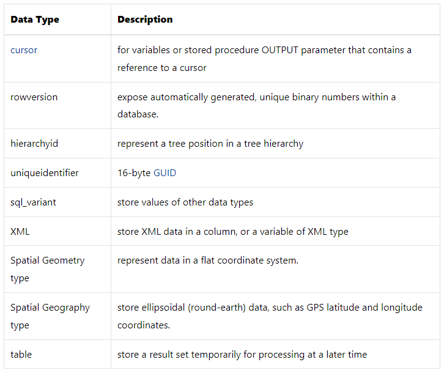

# DDL (Data Definition Language)

## Content Table

- [Create Database](#create-first-database)
- [Create DB If Not Exists](#create-database-if-not-exist)
- [Switch DBs](#switch-database)
- [Drop DB](#drop-database-deleteremove)
- [Drop DB If Exists](#drop-database-if-exists)
- [Creating Tables](#creating-tables)
- [SQL Data Types](#sql-data-types)
- [Drop Tables](#drop-tables)

## Create First Database

- You have to connect to your **_SQL_** server via **_SSMS_** (SQL Server Management System)

You can create a new database by right clicking on the database folder and select **_new database_** than enter the DB name and hit **_ok_**

or using **_SQL_**

```sql
create database [database-name];
```

Ex

```sql
create database DB1;
```

and thing press `ctrl+F5` to check your query, Than press `F5` to execute the query

> If you don't see the database just right click on the **_databases_** folder and click **_refresh_**

---

## Create Database If Not Exist

Now if we tried this query again

```sql
create database DB1;
```

it will give us an error says

"Database 'DB1' already exists. Choose a different database name."

because there is already a database with the same name

to avoid this we write this

```sql
if not exists(select * from sys.databases where name = 'DB1')
begin
  create database DB1;
end
```

Now this

```sql
select * from sys.databases
```

will return all the databases in the system

second part

```sql
where name = 'DB1'
```

This additional condition says only return the databases with the name **_DB1_**

And finally we wrap all this inside an if statement that reverse the result if it's exist

> You can highlight any command and hit `F5` to execute the highlighted stuff

---

## Switch Database

> If we just open a new Query file it will execute on the **_master_** database

The following query used to switch DBs

```sql
use [database name];
```

Ex:

```sql
use students;
```

---

## Drop Database (Delete/Remove)

The following query used to drop(Delete/Remove) DBs

```sql
drop database [database name];
```

Ex:

```sql
drop database DB1;
```

---

## Drop Database If Exists

Just like [Create DB if not exists](#create-database-if-not-exist), But in reverse

```sql
if exists (select * from sys.databases where name = 'DB2')
begin
  drop database DB2;
end
```

---

## Creating Tables

You can create tables using the mouse, By expand the database you want to create table

You will see a bench of folders, Right click on the 'Tables' folder select New -> Table

Here are some data type things you should know

- char(n): It allocate 'n' number of character even if not all used, And only store ASCII values(Not supporting other languages) which is not recommended to use

- nchar(n): Same as **_char_** but support unicode

- varchar(n): It allocate 'n' number of character, But shrink them down to the values inside, i.e. "Ali" will use 3 characters and deallocate 47 character, And this type doesn't support unicode

- nvarchar(n): Same as **_varchar_** but support unicode

> You can set any filed/column as primary key by right click on it and select 'set as primary key'

You can do all that with the mouse

Than hit `Ctrl+s` to save the table and right click on the 'Tables' folder and refresh to show the table

To do the same with the scripts this is the syntax

```sql
create table [table name] (
  [column name] [column type] [is nullable]
  primary key ([column name])
)
```

EX:

```sql
use students;

create table firstStage (
  id int not null,
  name nvarchar(50) not null,
  phone_one nvarchar(15) not null,
  phone_two nvarchar(15) null,
  primary key (id)
)
```

---

## SQL Data Types


> Notice that SQL Server will remove ntext, text, and image data types in its future version. Therefore, you should avoid using these data types and use nvarchar(max), varchar(max), and varbinary(max) data types instead.

### Exact numeric data types

They are types store exact numbers such as integer, decimal, or monetary amount.

- The bit store one of three values 0, 1, and NULL
- The int, bigint, smallint, and tinyint data types store integer data.
- The decimal and numeric data types store numbers that have fixed precision and scale. Note that decimal and numeric are synonyms.
- The money and smallmoney data type store currency values.
- The following table illustrates the characteristics of the exact numeric data types:



### Approximate numeric data types



### Character strings data types



### Unicode character string data types



### Date & Time data types



### Binary string data types



### Other data types



---

## Drop Tables

You can use the mouse or this script

```sql
use [database name]

drop table [table name]
```

EX:

```sql
use students

drop table firstStage
```

---

## Alter Tables (Editing Tables)

### Add Column

Select the database that contains the table, And do the following

```sql
alter table [table name] add [column name] [column data type] [nullable]
```

EX:

```sql
alter table students add age smallint not null
```

Of course you can edit the table using the designer just right mouse click on the table or the column name

### Rename Column

> In most databases this syntax is supported, But not Microsoft SQL server

EX:

```sql
alter table firstStage rename column phone_one to phone;
```

> There are functions stored at the database level called **_Stored Procedures_** you can execute them

For the rename function this can called

```sql
exec [stored procedure name] [...parameters]
```

- sp_rename

```sql
exec sp_rename '[table].[column name]', '[new column name]', 'column';
```

EX:

```sql
exec sp_rename 'firstStage.phone_one', 'phone', 'column';
```

### Rename Table

To rename a table in most databases we use this syntax

```sql
alter table [old name] rename to [new name];
```

We can use the same stored procedure `sp_rename` but with different arguments

```sql
exec sp_rename '[old name]', '[new name];
```

EX:

```sql
exec sp_rename 'firstStage', 'juniors';
```

### Modify Column

We use the `alter` keyword

Basic Syntax

```sql
alter table [table name] alter column [column name] [data-type] [nullable];
```

EX:

```sql
alter table juniors alter column phone_two nvarchar(15) not null;
```

This keeps the data type but changes the filed from nullable to not nullable

If you removed the `[nullable]` option it would be nullable by default

EX:

```sql
alter table juniors alter column phone_two nvarchar(15);
```

> Some DBs uses `modify` instead of the second `alter`

```sql
alter table [table name] modify column [column name] [data-type] [nullable];
```

### Delete Column

Basic syntax

```sql
alter table [table name] drop column [column name];
```

EX:

```sql
alter table juniors drop column phone_two;
```

This will remove **_phone_two_** column

Now let's learn how to [backup and restore](./backup-restore.md) databases
