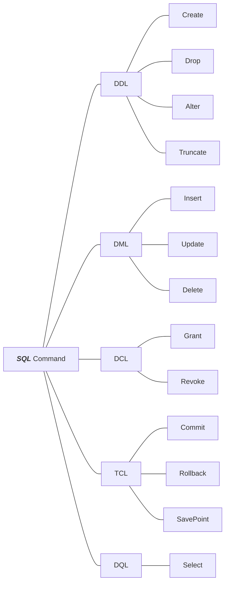

# SQL

It makes getting data from any table easier and more readable

Before when we get the data from a file we must do this steps

1. Get all data
2. Store them in array
3. Filter them

Now with **_SQL_** you can do all this in one line

```SQL
  Select * from Students Where Gender = 'F'
```

This will get all females student

**_SQL_** stands for Structure Query Language, It is a communication tool with the DB, And lets you access and manipulate data

**_SQL_** is widely use in many DBMS such as Oracle, Sybase, Microsoft SQL Server, And Access

**_SQL_** is a set of statements

## SQL Statements Types

- Data Definition Language (DDL)

- Date Manipulation Language (DML)

- Data Control Language (DCL)

- Transaction Control Language (TCL)

- Date Query Language (DQL)



Now let's take them one by one

1. [DDL](./ddl.md)
