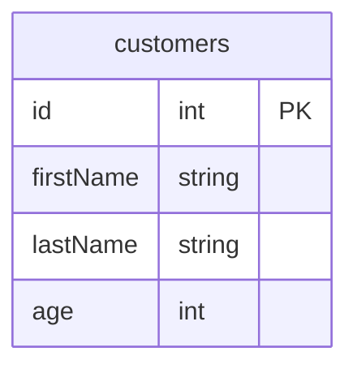
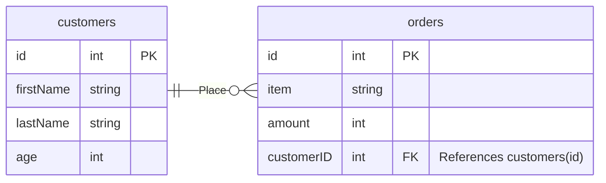
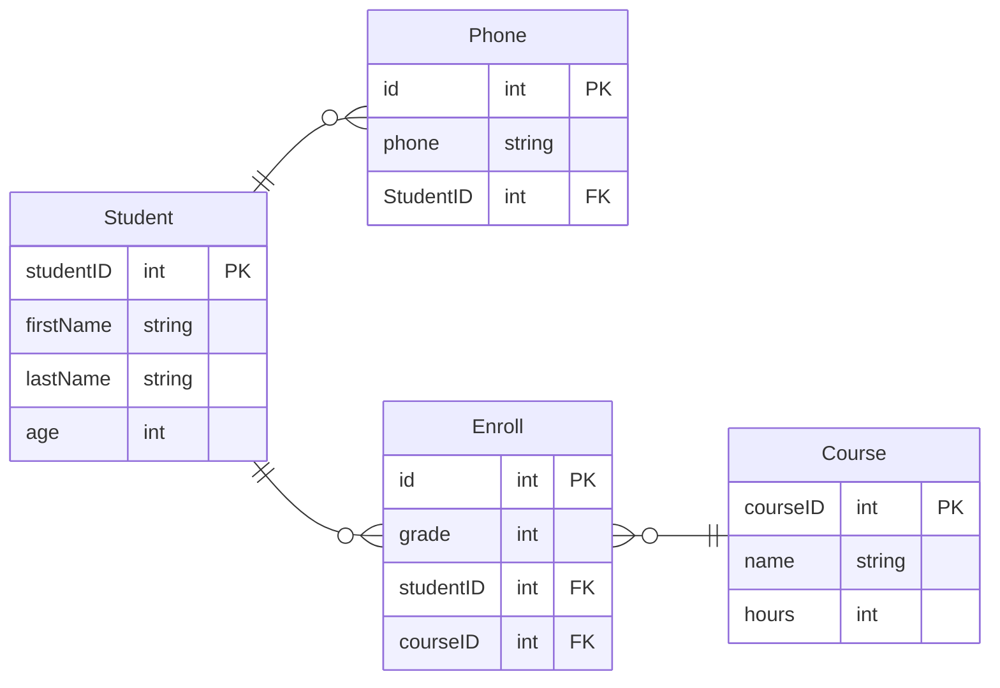
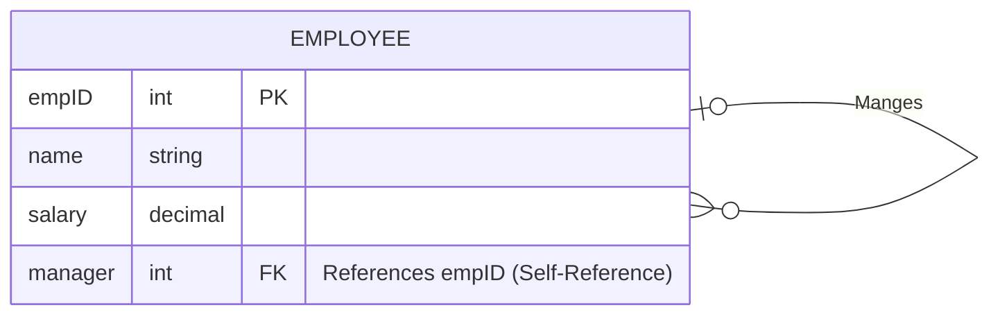
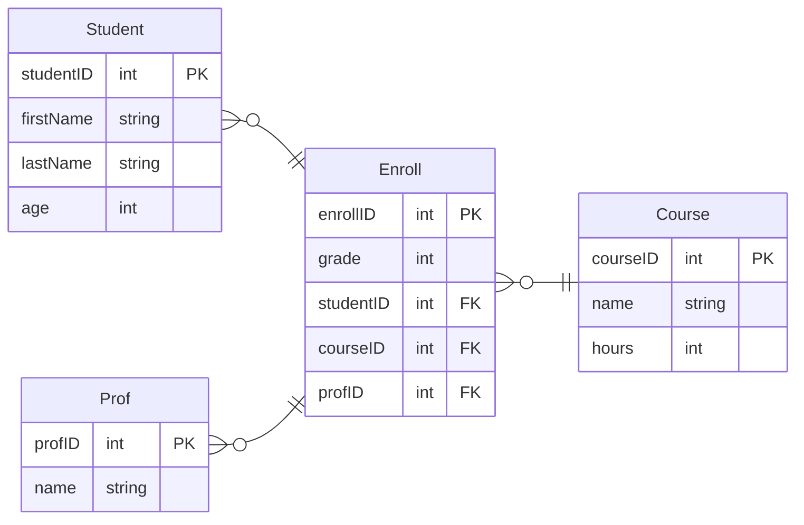
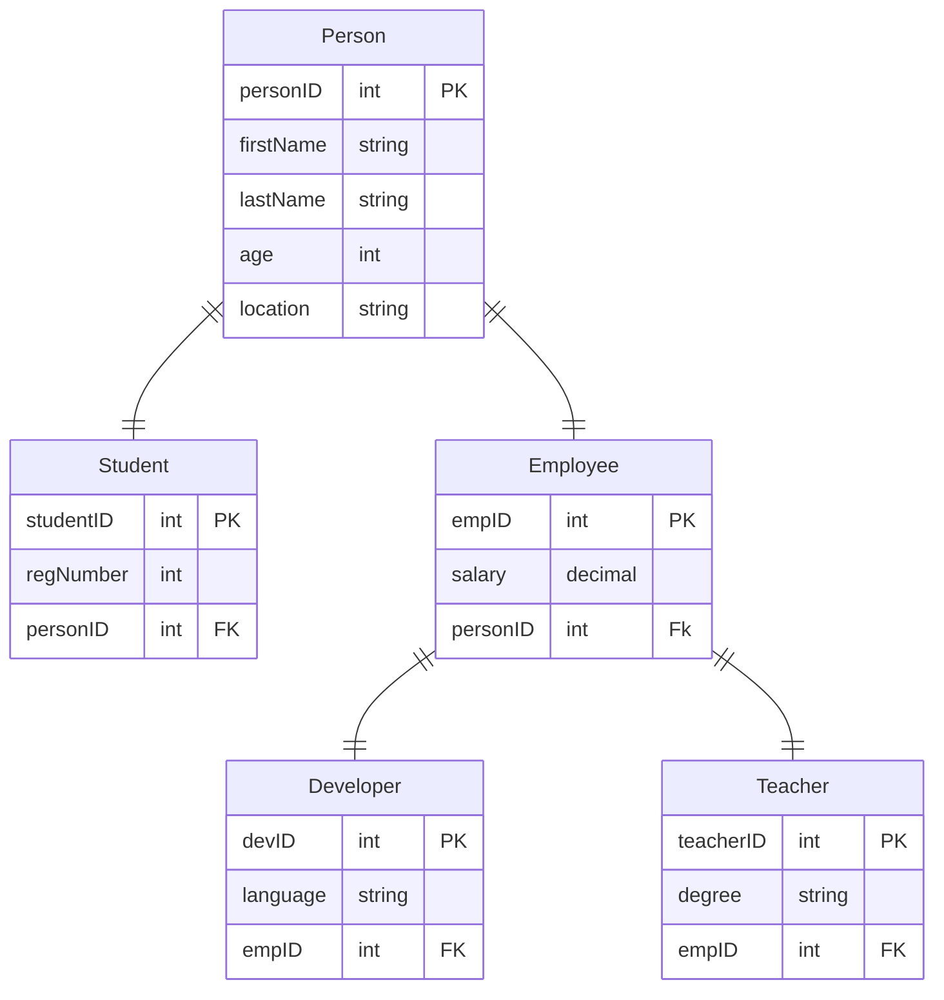

# MISC

To identify filed (Auto numbers);

You can change it using the table designer

1. Expand the panel at the bottom
2. Under identity specifications expand it and enable (is identity)

Two options will enables

1. Identity increment: choose the amount of increment
2. Identity seed: initial value

Now if you right click on the table and select edit, It won't allow you to enter anything in the id filed the server will take it from you

Even if you tried to inset values with code, Will return an error

```sql
insert into departments values (5, 'finance');
```

this will be the output

`An explicit value for the identity column in table 'departments' can only be specified when a column list is used and IDENTITY_INSERT is ON.
`

```sql
insert into departments values ('finance');
```

This will work fine

To print the last id (identity)

```sql
print @@identity
```

> If you deleted the whole table and start adding again the identity will continue from the last number

```sql
delete from departments
```

the table will be empty now

```sql
insert into departments values ('finance');
```

If we run this script again the 'finance' department will take id of 5

---

Now how to do the same with the code

```sql
create table [table name] (
  [filed name] [filed type] identity(increment, seed) [nullable],

  primary key ([filed name])
)
```

Ex:

```sql
create table departments (
  id int identity(1, 1) not null,
  name nvarchar(100) not null,
  primary key (id)
)
```

---

## Delete Vs. Truncate

### Delete will just remove the record and doesn't reset the identity counter

### Truncate will erase the the whole table and restart the identity counter

> You can add condition to **_truncate statement_**

---

## Foreign Key Constant

Notice:

> PK and FK must have the same datatype

Notice:

> You can't create a table with PK before a table with PK How can you link it


The script will be like this

```sql
create table customers (
  id int identity(1, 1) not null,
  firstName nvarchar(50) not null,
  lastName nvarchar(50) not null,
  age smallint not null,
  primary key (id)
)
```

<div align="center">



</div>

Now to create orders table and link it to the customers tables

```sql
create table orders (
  id int identity(1, 1) not null,
  item nvarchar(50) not null,
  amount smallint not null,
  customerID int references customers(id),
  primary key (id)
)
```

<div align="center">



</div>

### Remarks

- If you tried to add data to the **_orders_** table it will check the customer id before adding the data

- If You tried to delete **_customers_** table this will result an error because you might have orders related to customers

- You can't delete a customer if he had orders

If you want to add FK after creation you can so using **_alter_**

```sql
alter table [table to add FK to] add foreign key [FK name] references [table contains PK](PK filed name);
```

Ex:

```sql
alter table orders add foreign key (customerID) references customers(id);
```

---

## Exercises

Convert the following relational schema to real database **(Ignore the relationships for now just link the tables)**

**Exercise 1**



[**Solution (Try Harder First)**](#exercise-1-solution)

---

**Exercise 2**



[**Solution (Try Harder First)**](#exercise-2-solution)

---

**Exercise 3**



[**Solution (You Can Do It)**](#exercise-3-solution)

---

**Exercise 4**



[**Solution (I Know You Can)**](#exercise-4-solution)

---

## Exercise 1 Solution

```sql
create table students
(
  id int identity(1, 1) not null,
  firstName nvarchar(50) not null,
  lastName nvarchar(50) not null,
  age smallint not null,
  primary key (id)
)

create table courses
(
  id int identity(1, 1) not null,
  name nvarchar(40) not null,
  hours int not null,
  primary key (id)
)

create table phones
(
  id int identity(1, 1) not null,
  phone varchar(15) not null,
  studentID int references students(id),
  primary key (id),
)

create table enrollments
(
  id int identity(1, 1) not null,
  grade int not null,
  studentID int references students(id),
  courseID int references courses(id),
  primary key (id)
)
```

---

## Exercise 2 Solution

```sql
create table employees (
  id int identity(1, 1) primary key,
  name nvarchar(100) not null,
  salary smallmoney not null,
  managerID int references employees (id),
)
```

## Exercise 3 Solution

```sql
create table students
(
  id int identity(1, 1) primary key,
  firstName nvarchar(40) not null,
  lastName nvarchar(40) not null,
  age smallint,
)

create table profs
(
  id int identity (1, 1) primary key,
  name nvarchar(100) not null,
)

create table courses
(
  id int identity(1, 1) primary key,
  name nvarchar(60) not null,
  hours smallint not null,
)

create table enrollments
(
  id int identity(1, 1) primary key,
  grade float not null,
  studentID int references students(id),
  courseID int references courses(id),
  profID int references profs(id),
)
```

## Exercise 4 Solution

```sql
create table people
(
  id int identity(1, 1) primary key,
  firstName nvarchar(50) not null,
  lastName nvarchar(50) not null,
  age smallint not null,
  currentLocation nvarchar(50)
)

create table students
(
  id int identity(1, 1) primary key,
  regNumber int not null,
  personID int references people(id)
)

create table employees
(
  id int identity(1, 1) primary key,
  salary decimal not null,
  personID int references people(id)
)

create table developers
(
  id int identity(1, 1) primary key,
  programmingLang nvarchar(10) not null,
  employeeID int references employees(id)
)

create table teachers
(
  id int identity(1, 1) primary key,
  degree nvarchar(20) not null,
  employeeID int references employees(id)
)
```

Extra Exercise: Do the same but with the **_alter_** command, Just copy the code above and remove the last line (The line the FK)

Now let's learn some [queries](./dql.md)
